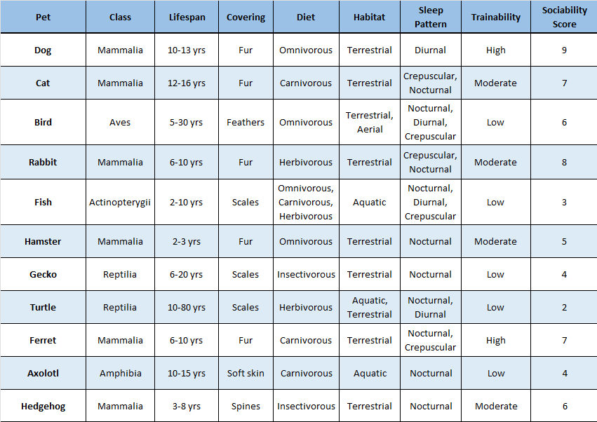
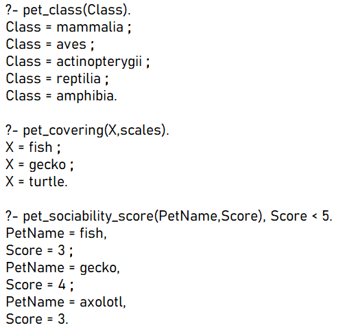
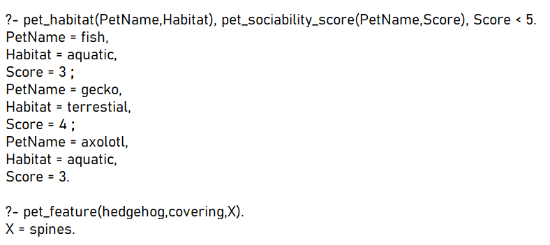
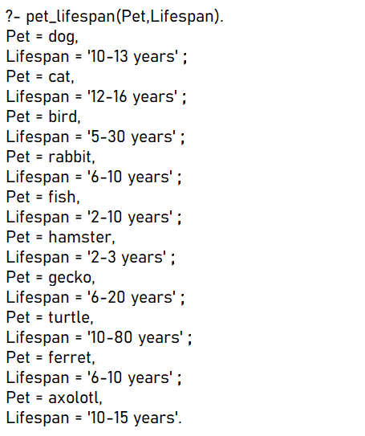
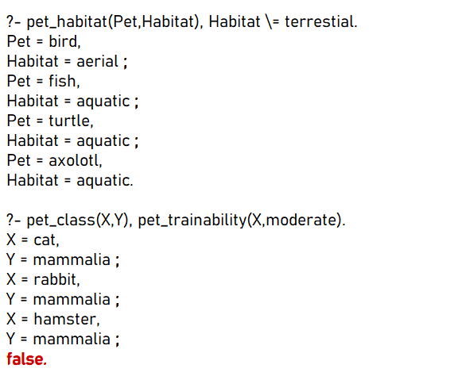
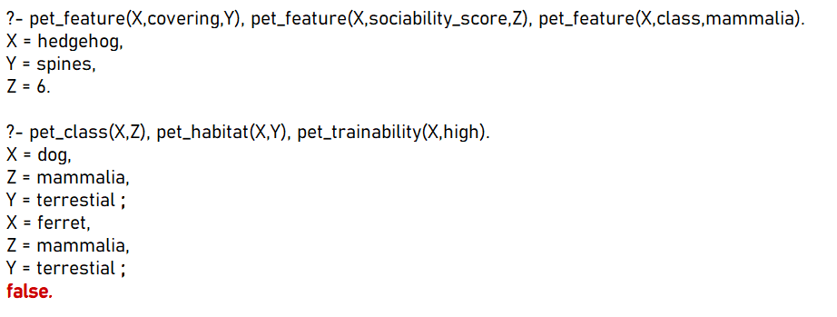

# Expert System in Prolog

## Expert Systems

  Expert systems are artificial intelligence applications that simulate the expertise of a human expert in a specific domain. They are typically designed to solve a particular problem and can provide recommendations or assist with decision-making.

## Prolog

  Prolog is a programming language used in the field of artificial intelligence and logic programming. It is based on the programming paradigm of logic programming, also known as "Programming Logic".

  In Prolog, programmers define the data and facts in a database, and then create rules that operate on these facts to provide recommendations to the user. Prolog is especially popular as a language for developing expert systems, inference engines, and decision-making systems, due to its natural fit with the logic programming paradigm.

## This Expert System Example

   Due to the lack of an expert, this expert system example uses the following table as a knowledge base (The information in the table does not necessarily reflect reality). This expert system example consists of four parts: facts, questions, rules, and queries.
  

 
**Facts:** This section contains the facts of the system. It is where the feature values of pets, pet types, and their corresponding feature values are defined in the code.
**Questions:**  This section prompts the user with questions and, based on their answers, identifies the pet type using the rules.
**Rules:** This section contains the rules for identifying pet types based on their features in the table. When diagnosing, the expert system evaluates the user's answers based on these rules to make a diagnosis.
**Queries:** This section provides query examples that can be executed from the console. The queries defined here can be answered by the expert system based on the facts defined in the system. 

Below are some examples of queries that have been executed in the console:

